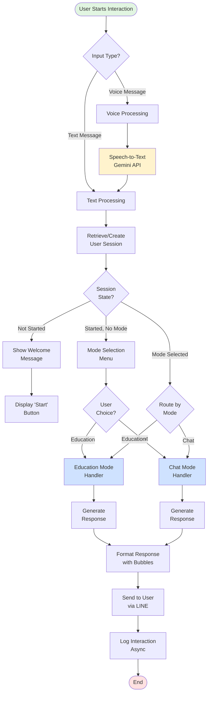
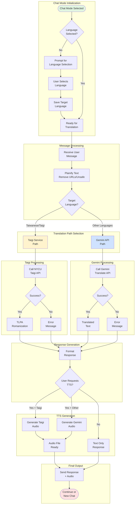
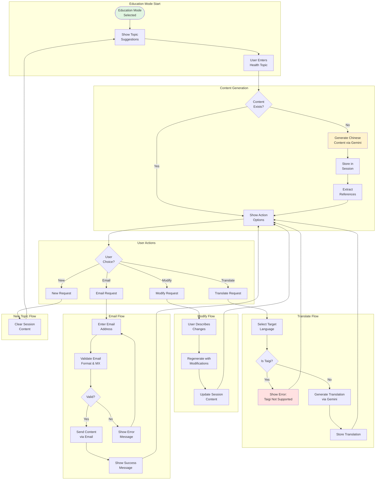
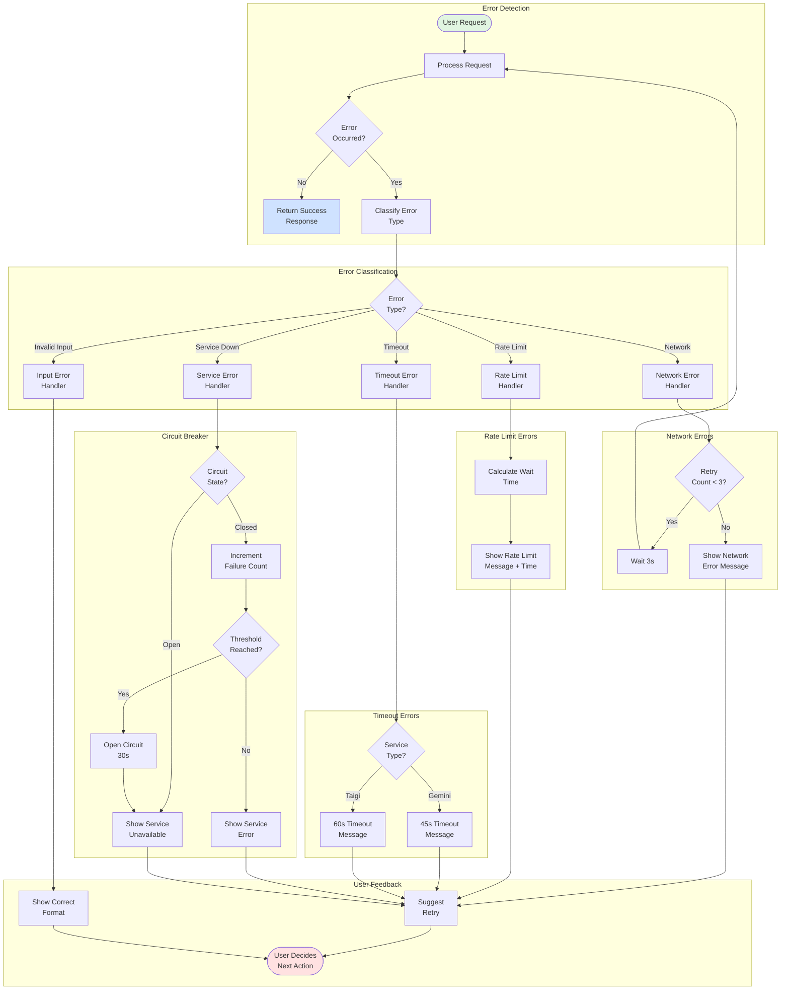
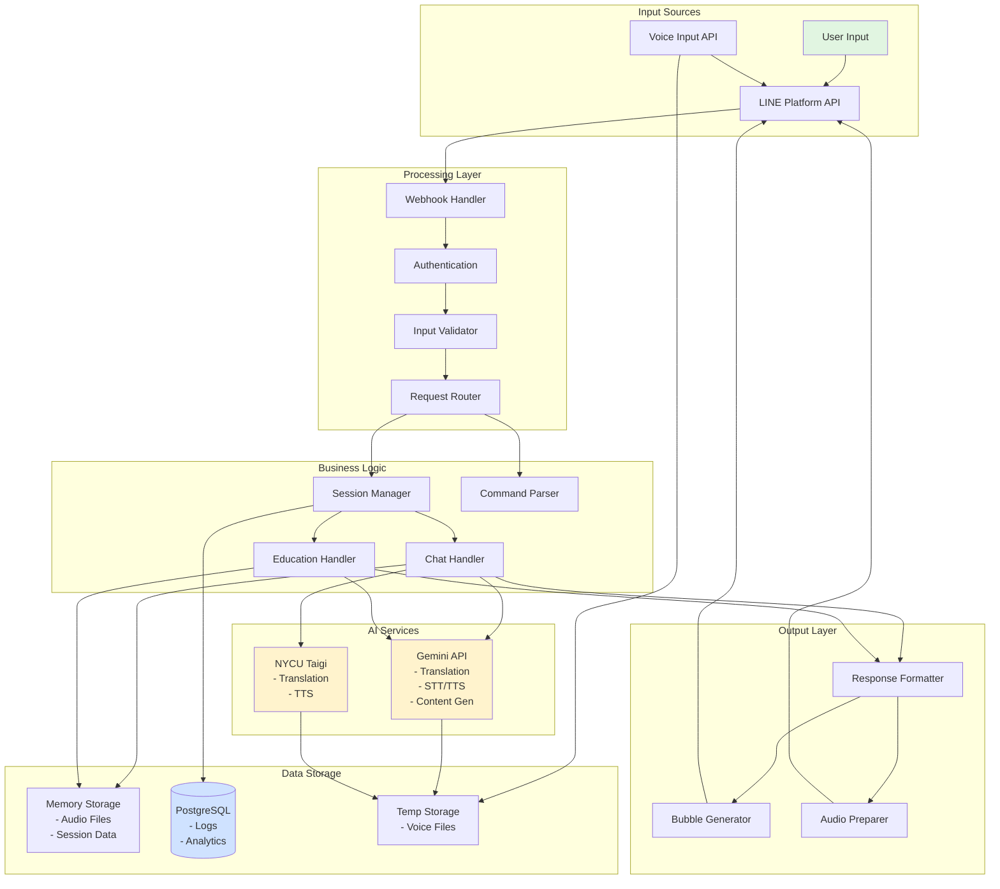
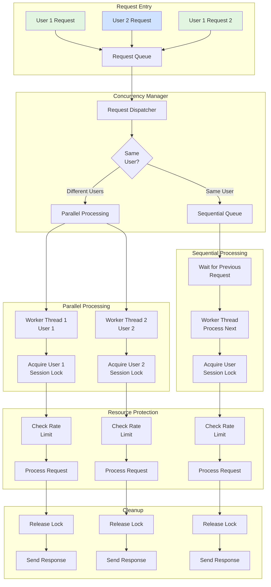

# MedEdBot System Flowcharts and Diagrams

## 1. Master System Flow

## 2. Chat Mode Detailed Flow

## 3. Education Mode Detailed Flow

## 4. Voice Processing Flow

```mermaid
flowchart LR
    subgraph "Voice Input Processing"
        VOICE([Voice Message<br/>Received]) --> CHECK_MODE{Mode &<br/>Language Set?}
        CHECK_MODE -->|No| REJECT[Reject with<br/>Instructions]
        CHECK_MODE -->|Yes| DOWNLOAD[Download Audio<br/>from LINE]
        
        DOWNLOAD --> SAVE[Save to<br/>Temp File]
        SAVE --> SIZE_CHECK{Size<br/>< 10MB?}
        SIZE_CHECK -->|No| SIZE_ERROR[Error:<br/>File Too Large]
        SIZE_CHECK -->|Yes| TRANSCRIBE[Transcribe via<br/>Gemini STT]
        
        TRANSCRIBE --> CHECK_STT{Success?}
        CHECK_STT -->|No| STT_ERROR[Error:<br/>Transcription Failed]
        CHECK_STT -->|Yes| GET_TEXT[Extract<br/>Text]
        
        GET_TEXT --> DELETE[Delete Audio<br/>File Immediately]
        DELETE --> PROCESS[Process as<br/>Text Input]
        
        PROCESS --> MEDCHAT[Send to<br/>MedChat Handler]
        MEDCHAT --> RESULT[Get Translation<br/>Result]
        
        RESULT --> FORMAT[Add Voice<br/>Indicator 🎤]
        FORMAT --> SEND[Send Response<br/>to User]
    end
    
    style VOICE fill:#e1f5e1
    style REJECT fill:#ffe1e1
    style SIZE_ERROR fill:#ffe1e1
    style STT_ERROR fill:#ffe1e1
    style DELETE fill:#fff3cd
```

## 5. TTS Generation Flow

```mermaid
flowchart TB
    subgraph "TTS Request Processing"
        TTS_START([User Clicks<br/>朗讀/Speak]) --> CHECK_CONTENT{Translation<br/>Exists?}
        CHECK_CONTENT -->|No| NO_CONTENT[Error: No Content<br/>to Speak]
        CHECK_CONTENT -->|Yes| CHECK_AUDIO{Audio Already<br/>Generated?}
        
        CHECK_AUDIO -->|Yes| RETURN_EXISTING[Return Existing<br/>Audio URL]
        CHECK_AUDIO -->|No| DETECT_LANG{Last Translation<br/>Language?}
    end
    
    subgraph "Language-Specific TTS"
        DETECT_LANG -->|Taiwanese/Taigi| TAIGI_TTS_FLOW
        DETECT_LANG -->|Other Languages| GEMINI_TTS_FLOW
    end
    
    subgraph "Taigi TTS Process"
        TAIGI_TTS_FLOW[Taigi TTS Path] --> GET_CHINESE[Get Original<br/>Chinese Text]
        GET_CHINESE --> CHECK_CHINESE{Chinese Text<br/>Available?}
        CHECK_CHINESE -->|No| TAIGI_ERROR[Error: No Source<br/>for Taigi TTS]
        CHECK_CHINESE -->|Yes| CALL_TAIGI[Call NYCU<br/>Taigi TTS API]
        
        CALL_TAIGI --> TAIGI_RESULT{Success?}
        TAIGI_RESULT -->|Yes| TAIGI_AUDIO[Save Taigi<br/>Audio File]
        TAIGI_RESULT -->|No| TAIGI_TTS_ERROR[Error: TTS<br/>Generation Failed]
        
        TAIGI_AUDIO --> SET_CREDIT[Set Credit<br/>Flag = True]
    end
    
    subgraph "Gemini TTS Process"
        GEMINI_TTS_FLOW[Gemini TTS Path] --> GET_TRANS[Get Translated<br/>Text]
        GET_TRANS --> CALL_GEMINI[Call Gemini<br/>TTS API]
        
        CALL_GEMINI --> GEMINI_RESULT{Success?}
        GEMINI_RESULT -->|Yes| GEMINI_AUDIO[Save Audio<br/>File]
        GEMINI_RESULT -->|No| GEMINI_TTS_ERROR[Error: TTS<br/>Generation Failed]
    end
    
    subgraph "Audio Delivery"
        TAIGI_AUDIO --> STORE_URL[Store Audio URL<br/>in Session]
        GEMINI_AUDIO --> STORE_URL
        SET_CREDIT --> STORE_URL
        
        STORE_URL --> CALC_DUR[Calculate Audio<br/>Duration]
        CALC_DUR --> PREPARE[Prepare Audio<br/>Message]
        
        PREPARE --> CHECK_CREDIT{Show Taigi<br/>Credit?}
        CHECK_CREDIT -->|Yes| WITH_CREDIT[Send Credit Bubble<br/>+ Audio]
        CHECK_CREDIT -->|No| WITHOUT_CREDIT[Send Audio<br/>Only]
        
        RETURN_EXISTING --> WITHOUT_CREDIT
    end
    
    style TTS_START fill:#e1f5e1
    style NO_CONTENT fill:#ffe1e1
    style TAIGI_ERROR fill:#ffe1e1
    style TAIGI_TTS_ERROR fill:#ffe1e1
    style GEMINI_TTS_ERROR fill:#ffe1e1
```

## 6. Session Management Flow

```mermaid
stateDiagram-v2
    [*] --> NewUser: First Interaction
    
    NewUser --> CreateSession: Initialize Session
    CreateSession --> NotStarted: Set started=false
    
    NotStarted --> Started: User clicks "開始"
    Started --> ModeSelection: Set started=true
    
    ModeSelection --> EducationMode: Select "衛教"
    ModeSelection --> ChatMode: Select "醫療翻譯"
    
    state ChatMode {
        [*] --> AwaitingLanguage: Set mode=chat
        AwaitingLanguage --> LanguageSet: User selects language
        LanguageSet --> ReadyToTranslate: Save target language
        ReadyToTranslate --> Processing: Receive message
        Processing --> ReadyToTranslate: Show result
    }
    
    state EducationMode {
        [*] --> AwaitingTopic: Set mode=edu
        AwaitingTopic --> ContentGenerated: Generate content
        ContentGenerated --> ShowingOptions: Display actions
        
        ShowingOptions --> Modifying: User selects modify
        Modifying --> ContentGenerated: Update content
        
        ShowingOptions --> Translating: User selects translate
        Translating --> ContentGenerated: Add translation
        
        ShowingOptions --> Emailing: User selects email
        Emailing --> ShowingOptions: Send complete
    }
    
    ChatMode --> Reset: User clicks "新對話"
    EducationMode --> Reset: User clicks "新對話"
    Reset --> NotStarted: Clear session
    
    NotStarted --> SessionExpired: 24 hours inactive
    Started --> SessionExpired: 24 hours inactive
    ModeSelection --> SessionExpired: 24 hours inactive
    ChatMode --> SessionExpired: 24 hours inactive
    EducationMode --> SessionExpired: 24 hours inactive
    
    SessionExpired --> [*]: Delete session
```

## 7. Error Handling and Recovery Flow

## 8. Data Flow Architecture

## 9. Concurrency Control Flow

## 10. Quick Reference - Command Flow

```mermaid
graph LR
    subgraph "Global Commands"
        NEW[new/開始] --> RESET[Reset Session]
        SPEAK[speak/朗讀] --> TTS[Generate Audio]
    end
    
    subgraph "Education Mode Commands"
        MODIFY[modify/修改] --> MOD_FLOW[Modification Flow]
        TRANSLATE[translate/翻譯] --> TRANS_FLOW[Translation Flow]
        MAIL[mail/寄送] --> EMAIL_FLOW[Email Flow]
    end
    
    subgraph "Chat Mode Commands"
        CONTINUE[繼續翻譯] --> KEEP_LANG[Keep Language<br/>New Message]
        CHANGE[更改語言] --> CHANGE_LANG[Change Target<br/>Language]
    end
    
    style NEW fill:#e1f5e1
    style SPEAK fill:#fff3cd
    style MODIFY fill:#cfe2ff
    style TRANSLATE fill:#cfe2ff
    style MAIL fill:#cfe2ff
```

---

These flowcharts provide comprehensive visual documentation of:
1. Overall system architecture and flow
2. Mode-specific processing paths
3. Error handling and recovery mechanisms
4. Concurrency control systems
5. Data flow patterns
6. Command processing flows

Each diagram can be rendered using Mermaid-compatible tools and provides clear technical documentation suitable for patent filing purposes.